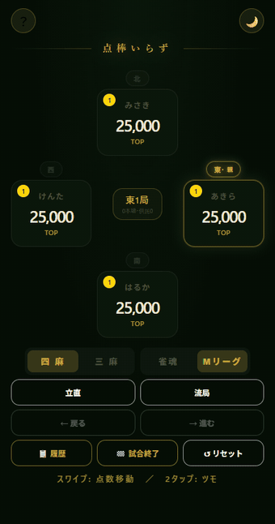

# 点棒いらず

麻雀の点数移動をスワイプ操作で記録できる、単一HTMLのPWA点数管理アプリ。

**▶ アプリを開く: https://ceta211.github.io/mahjong-score/**



## 操作方法

| 操作 | 動作 |
|------|------|
| カードをスワイプ | 相手への点数移動（ロン） |
| カードを2回タップ | ツモ入力 |
| カードを1回タップ | 点数の調整（加算・減算・チョンボ） |
| 方角ラベルをタップ | 親の設定 |
| 中央パネルをタップ | 局・本場・供託の手動修正 |
| 立直ボタン | リーチ宣言（-1,000点を供託へ） |
| 流局ボタン | テンパイ選択 → ノーテン罰符の自動分配 |

## 主な機能

- **雀魂 / Mリーグ 2軸ルール対応** — ウマ・オカ・切り上げ満貫・飛び挙動・途中流局を自動切替
- **点数表チップ** — 1飜30符〜役満（雀魂モードはダブル役満〜6倍役満まで）
- **ゲーム進行の自動化** — 連荘 / 親流れ・局・本場・供託を自動更新
- **本場の自動加算** — ロン+300 / ツモ各+100 を入力にプリフィル
- **精算** — 素点・ウマ・オカを自動計算（雀魂: 5-15 / Mリーグ: 10-30+オカ20）
- **対局状態の永続化** — リロードしても点数・局・本場・供託・リーチ状態を復元
- **PWA** — ホーム画面に追加してオフラインでも利用可能
- 四麻 / 三麻、ダーク / ライトテーマ、undo / redo、対局履歴

## 開発

ビルド不要。`index.html` 1ファイル（vanilla JS）+ `sw.js`（Service Worker）。

```bat
REM ヘッドレステスト（jsdom）
node test_output/headless_test.js
node test_output/headless_test2.js
node test_output/headless_test3.js
node test_output/headless_test4.js

REM 操作デモGIFの再収録（要 Chrome + ffmpeg）
node tools/record_demo.js
```
