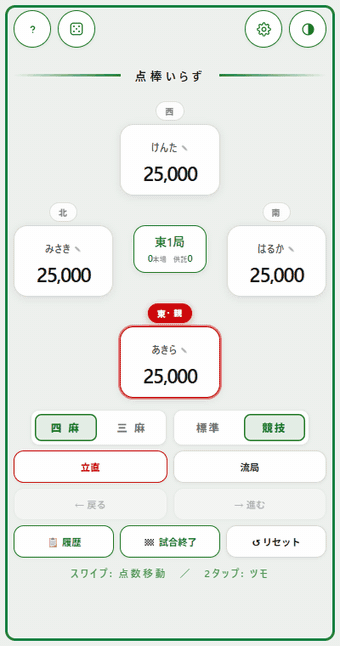

# 点棒いらず

麻雀の点数移動をスワイプ操作で記録できる、単一HTMLのPWA点数管理アプリ。

**▶ アプリを開く: https://ceta211.github.io/mahjong-score/**



## 操作方法

| 操作 | 動作 |
|------|------|
| カードをスワイプ | 相手への点数移動（ロン） |
| カードを2回タップ | ツモ入力 |
| カードを1回タップ | 点数の調整（加算・減算・チョンボ） |
| 方角ラベルをタップ | 親の設定 |
| 名前編集モーダルのハンドルをドラッグ | 席替え（名前の入れ替え） |
| 中央パネルをタップ | 局・本場・供託の手動修正 |
| 立直ボタン | 立直宣言（-1,000点を供託へ） |
| 流局ボタン | テンパイ選択 → ノーテン罰符の自動分配 |

## 主な機能

- **標準 / 競技 2軸ルール対応** — ウマ・オカ・切り上げ満貫・飛び挙動・途中流局を自動切替
- **点数表チップ** — 1飜30符〜役満（標準モードは5倍・6倍役満まで。複合役満2〜4倍は両モード対応）
- **ゲーム進行の自動化** — 連荘 / 親流れ・局・本場・供託を自動更新
- **本場の自動加算** — ロン+300 / ツモ各+100 を入力にプリフィル
- **ダブロン対応** — 2件目は「局を進めない」チェックで入力
- **精算** — 素点・ウマ・オカを小数1桁で自動計算（標準: 5-15 / 競技: 10-30+オカ20）。結果のコピー / 共有付き
- **対局状態の永続化** — リロードしても点数・局・本場・供託・立直状態を復元
- **PWA** — ホーム画面に追加してオフラインでも利用可能
- 四麻 / 三麻、ダーク / ライトテーマ、undo / redo、対局履歴

## 開発

ビルド不要。`index.html` 1ファイル（vanilla JS）+ `sw.js`（Service Worker）。

```bat
REM 初回のみ: 依存導入（jsdom 等）
npm install

REM ヘッドレステスト（jsdom・全7スイート）
npm test

REM 操作デモGIFの再収録（要 Chrome + ffmpeg。前提は tools/README.md 参照）
node tools/record_demo.js
```

**iOS（Capacitor）関連の注意**: ローカルで同期するときは素の `npx cap sync` ではなく必ず `npm run sync` を使う（`www/` の再生成を挟まないと古いバンドルが同梱される）。詳細は `ios-build/README.md`。
